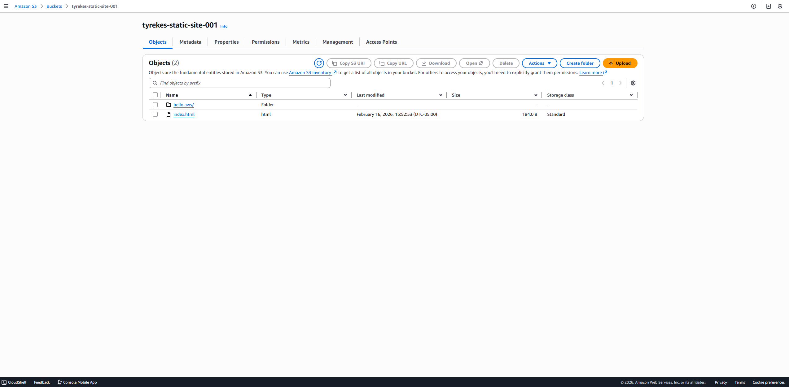
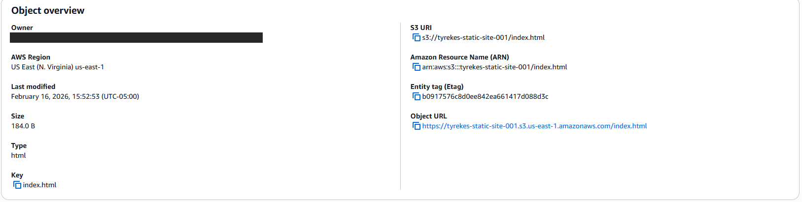
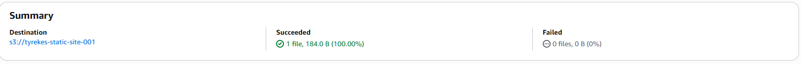

# AWS S3 Static File Hosting Demo

Uploaded a static HTML page to Amazon S3 and verified it was stored with the correct content type so a browser renders it as a web page.

## Services

- Amazon S3
- AWS Management Console

## Steps

1. Created the bucket `tyrekes-static-site-001` in us-east-1.
2. Wrote a simple `index.html` page.
3. Fixed the file extension so S3 assigned the correct MIME type (`text/html`). With the wrong extension, browsers download the file instead of displaying it.
4. Uploaded the file and confirmed the upload succeeded.
5. Checked the object's metadata to verify the type and storage class.

## What I Learned

- **Buckets and objects:** a bucket is the container, and every file is an object with a key, metadata, and an ARN.
- **MIME types matter:** S3 serves files with the content type they were stored with. The wrong type breaks how a browser handles the file.
- **Private by default:** new buckets block public access. Serving a public site requires deliberately changing the bucket policy or putting CloudFront in front of it.

## Screenshots

### Bucket created

### Object details

*Owner ID redacted.*

### Upload confirmation

